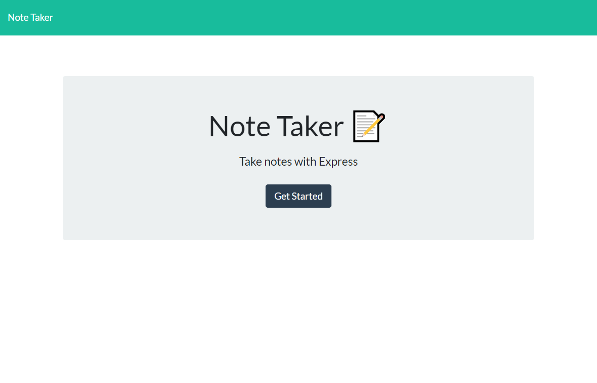
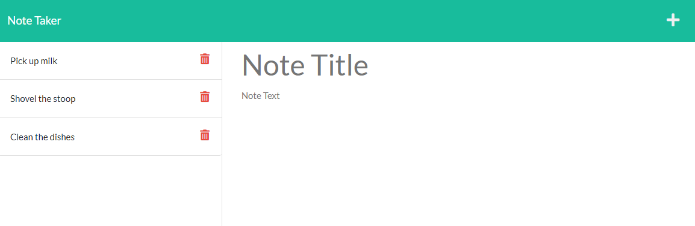
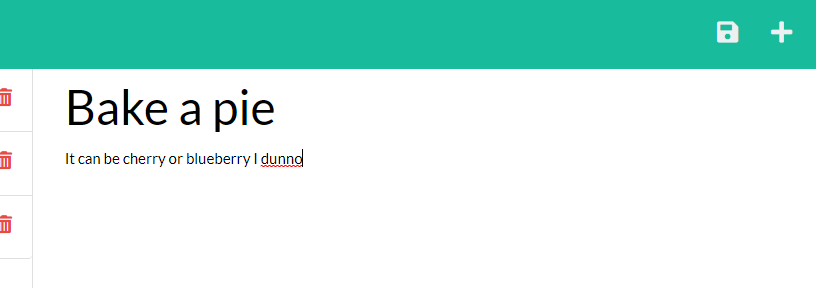
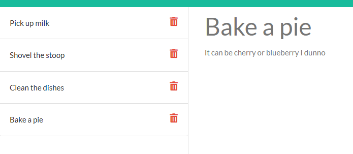

# Week 11: Note Taker

## Description
---
For our eleventh week in our coding bootcamp, we were tasked with creating the back end for an already existing front end project. We were to use Express.js and a number of other Node.js features to connect the full stack and deploy the whole thing to Heroku.

The intial challenge, and as is often the case with start code assignments, the daunting prospect of know how exactly this black box we've been handed even works. What inputs does it require, what is it expecting to hear, and what will it output. Luckily, thanks to the fetch paths in the script files and gentle guiding in the project guidelines, the server paths that are required can be descerned. 

First order of business was to link the public folder. That way only the actual pages themselves had to be set during get calls and all styling and front end scripting would go along with it. Once all the necsesary paths could be established and confirmed functional using Insomnia, it was just a matter of adding functionality to the requests. This was simple for GET requests, as we just had to send over index.html and notes.html respectively. A file writer helper function was added in order to keep clutter in server.js to a minimum during POST requests. 

Finally for the API requests we needed GET requests for all the notes and a note with a particular id, and the API POST request would server as the main note taking function, reading, appending, and writing new notes to the file. No fancy tricks or anything really, just sending the appropriate data per each request. Although one interesting "hack" was in order to send the most up to date version of db.json, it must be read using fs, parsed, and then sent. Otherwise it would send the db constant declare on server intialization. This worked between reloads, but not mid session. Finally the DELETE request was pretty simple to do as a bonus. Turns out DELETE requests aren't all that different from GET or POST requests, it's just another labeling that the server uses to discern incoming calls. So to make the DELETE logic, all I really did was take the write file helper function and tweaked a few things to remove an object from the array instead of adding it. After some bug squashing, our back end was complete!

## Aside
---
I'm not going to lie here, the preview of the application I was getting from Insomnia was missing about half the functionality the deployed website was supposed to have, and opening index.html in the default browser doesn't work due to the front end script polymorphism checking the url to see if it should run functions for index.html or notes.html. All the requests I tested worked just fine though. So when deploying it to Heroku I had to put complete blind faith into there being some limitations to what Insomnia can display. I was expecting it to be a complete flop and I'd have to submit everything half finished with a demo video showing that all my requests do in fact function but I suppose that isn't necesary anymore. So moral of the story is sometimes everything just decides to work for reasons unknown.

## Installation
---
Once you have cloned the repo to your machine, run **npm i** to install all the necesary dependencies.

Application is also deployed to Heroku at https://evening-forest-39312.herokuapp.com/

## Usage
---
- When starting the app you will be presented with a landing page, simply click on the "Get Started" button to view your notes.

- The left side bar will hold all previously entered notes and the right entry field will allow you to enter in a new note.

- Once you have entered text in both the title field and text field, a save button will appear in the upper right. Click it to save your note.

- Your entered note will now display in the side bar along will all previously entered notes.

- To view the full contents of your note, click on it from the side bar. The note's title and text will now populate the text entry field.

- To remove a note from the side bar, click on the red trash can icon.

## Tesing Requests
---
Once you have cloned the repo and installed all dependencies, run **npm run start** to initiate a local server. Then using an API applicaiton such as **Insomnia**, run GET, POST, and DELETE requests for the paths defined in **server.js**.

NOTE: Some functionality may be limitted compared to the full deployed site.

## License
---
Standard MIT license, coursework.
Starter code provided by the UofM Full Stack Coding Bootcamp.
Application hosted by [Heroku](https://www.heroku.com/platform)