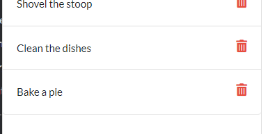

# Week 11: Note Taker

## Description

## Installation

Once you have cloned the repo to your machine, run **npm i** to install all the necesary dependencies.

Application is also deployed to Heroku at https://evening-forest-39312.herokuapp.com/

## Usage

- When starting the app you will be presented with a landing page, simply click on the "Get Started" button to view your notes.

- The left side bar will hold all previously entered notes and the right entry field will allow you to enter in a new note.

- Once you have entered text in both the title field and text field, a save button will appear in the upper right. Click it to save your note.

- Your entered note will now display in the side bar along will all previously entered notes.

- To view the full contents of your note, click on it from the side bar. The note's title and text will now populate the text entry field.

- To remove a note from the side bar, click on the red trash can icon.

## Tesing Requests

Once you have cloned the repo and installed all dependencies, run **npm run start** to initiate a local server. Then using an API applicaiton such as **Insomnia**, run GET, POST, and DELETE requests for the paths defined in **server.js**.

NOTE: Some functionality may be limitted compared to the full deployed site.

## License

Standard MIT license, coursework.
Starter code provided by the UofM Full Stack Coding Bootcamp.
Application hosted by [Heroku](https://www.heroku.com/platform)